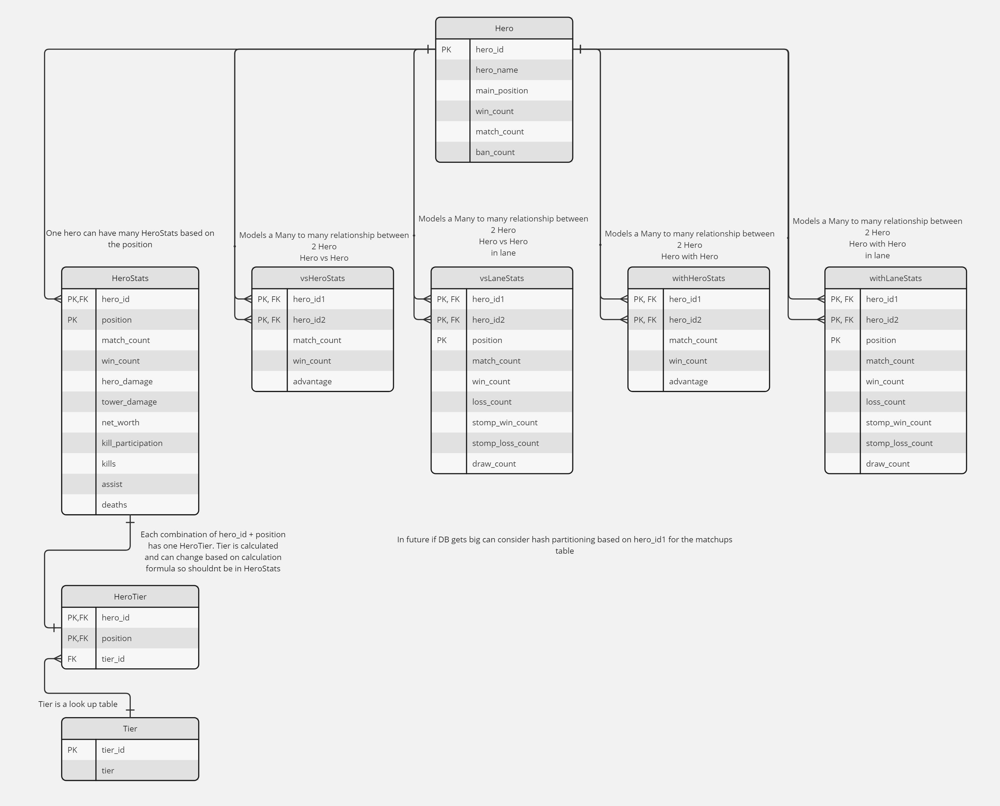
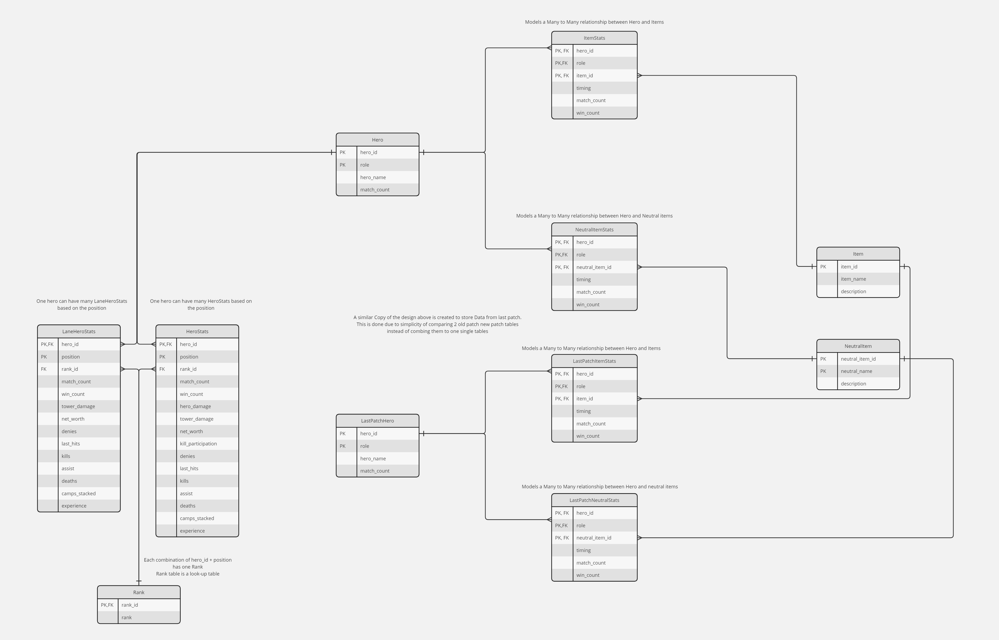
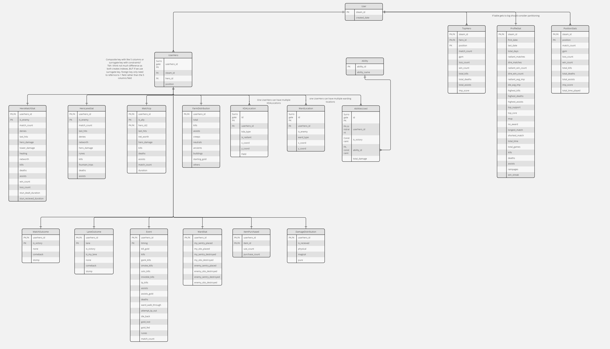

# DotaDocumentation

## Database Design
This section details the design of the database for Dotarecaps application. It includes the normalization process, Entity-Relationship Diagram (ERD), entity relationships, primary keys, foreign keys and indexes.

DotaRecaps was first designed using a de-normalized database back when i didn't know much about a good database design. Looking back at the database, I realised the poor design resulted in large amount of data redundancy, and a lack of usage of foreign keys to maintain data integrity and indexes to improve query speeds. Therefore, I decided to re-design a proper 3NF Database. However, this is only the design and the project hasn't yet migrated to this new design as it requires changing alot of queries that would take some time

### Normalization to 3NF
The database design process involved normalizing the schema to Third Normal Form (3NF) to minimize redundancy and ensure data integrity. 

**Normalization Steps:**
1. **First Normal Form (1NF):** Ensured that each table had a primary key and that all columns values were broken down to atomic values. The initial design had fields that stored what could have been broken done to smaller values

2. **Second Normal Form (2NF):** Ensured that all non-key attributes depends on the entire primary keys. 

3. **Third Normal Form (3NF):** Eliminated transitive dependencies by ensuring that all non-key attributes are dependent only on the primary key. The initial design stored lots of 'calculated' values such as winrate which can be derived from the atomic values total_wins/total_games. Since these calculated values are not very resource demanding to calcuate, I decided to remove these values to normalize the database, since after all these calculations queries happens rarely(only during the deployment of the website), and rather I should be focusing more on eliminating redundant data

## Entity-Relationship Diagrams (ERD)

### Overview

The following ERD diagrams illustrate different portions of the database schema, including entities, relationships, and attributes for various aspects of the system.

### Portion 1: HeroCounters 

### Overview

This database is actually seperated from the other 2 DBs as initially this DB was used as a seperate project. The database includes several many-to-many relationships between `Hero` entities. These relationships help model various interactions such as matchups, and synergies between heroes. Each relationship is represented by a intemediary table that models this many-many relationship. It also has a one-to-many table that captures the average stats performance of a hero based on the position played

### Tables

**Table:** `vsHeroStats`

- **Purpose:** Captures matchups between heroes for the entire game length.

**Table:** `withHeroStats`

- **Purpose:** Captures synergies between heroes for the entire game length.

**Table:** `vsLaneStats`

- **Purpose:** Captures matchups between heroes in the laning phase.

**Table:** `withLaneStats`

- **Purpose:** Captures synergies between heroes in the laning phase.

**Note** vsHeroStats/withHeroStats were seperated into 2 different table instead of combining to 1 as it better represents how the data is used in the website. For example withHeroStats data wont ever be combined with vsHeroStats data and they both have their own seperate table in the website

**Table:** `HeroStats`

- **Purpose:** Captures the performance stats of a hero based on the position played.

**Table:** `HeroTier`

- **Purpose:** Each combination of hero_id + position in HeroStats has one HeroTier. Tier is calculated and can change based on calculation formula so shouldnt be in HeroStats.

**Table:** `Tier`

- **Purpose:** Tier is a look up table for HeroTier 'tier_id' field

### Portion 2: DotaRecaps items 

### Overview
This section has 2 tables similar to HeroCounters portion (HeroStats, Hero) as HeroCounters was a seperate DB.
This table mainly stores 2 things, the many-to-many relationship between a Hero and a Item, and also the laning and the stats of a hero at the 30th minutes

### Tables

**Table:** `Hero`

- **Purpose:** Represents a Hero entity.

**Table:** `Item`

- **Purpose:** Represents a item entity.

**Table:** `NeutralItem`

- **Purpose:** Represents a neutral item entity.

**Table:** `ItemStats`

- **Purpose:** Captures how well a hero performs when a item is bought at a specific timing.

**Table:** `NeutralItemStats`

- **Purpose:** Captures how well a hero performs when a neutral item is bought at a specific timing.

**Table:** `LastPatchHero`

- **Purpose:** Represents a Hero entity but from the previous patch.

**Table:** `LastPatchItemStats`

- **Purpose:** Captures how well a hero performs when a item is bought at a specific timing for previous patch.

**Table:** `LastPatchNeutralStats`

- **Purpose:** Captures how well a hero performs when a neutral item is bought at a specific timing for previous patch.

**Table:** `LaneHeroStats`

- **Purpose:** Captures the average laning stats of a hero and rank. Used for comparing with user's performance.

**Table:** `HeroStats`

- **Purpose:** Captures the average game stats of a hero and rank. Used for comparing with user's performance.

**Table:** `Rank`

- **Purpose:** Rank table serves as a look-up table. Each combination of hero_id + position in HeroStats and LaneHeroStats has a field rank_id. Helps to maintain data integrity and ease of change in future

### Portion 2: DotaRecaps Profile analysis 

### Overview
This section includes tables meant for storing a user's hero analysis data. Since there are many tables and mainly self-explanatory i shall not note it down here one by one(for now)
